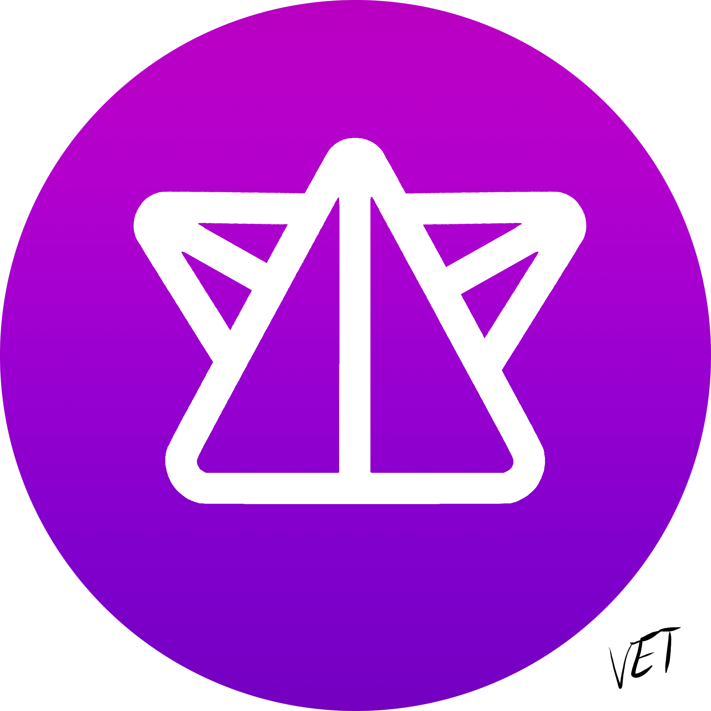

# Telegram-бот "VoidNFTBot"

## Иконка:

## Описание бота:

Бот создан для обмена картинками и их коллекционирования.

    ВНИМАНИЕ!
    Бот не работает!
    ВНИМАНИЕ!

### Установка и запуск:

* Установить все необходимые библеотеки **(pip install -r requirements.txt)**
* Запустить скрипт: **main.py**

### Эксплуатация:

* Найти в телеграмме бота: [@TeraNodaBot](https://t.me/TeraNodaBot)
* Нажать на кнопку "**START**" или прописать команду **/start**
* Начинать эксплуатацию (для помощи с командами можно обратиться в меню или прописать команду /help)
* Для того чтобы узнать ваш баланс прописываем **/balance**
* Для того чтобы узнать топ 10 лучших NFT-мейкеров бота прописываем **/leaders**

#### Загрузка картинок:

* Вводим команду **/create**
* У нас просят название картинки (то как ваша картинка будет называться в базе данных), вводим название.
* Далее, нас просят описание (то что увидят люди, которым попалась ваша картинка в магазине), вводим описание.
* Далее, нас просят ввести цену для этой картинки (то что заплатит покупатель и вы получите при покупке), обратите
  внимание, что для публикации **с вас спишется 5% от стоимости картинки**, по этому учитывайте это при выставлении
  цены!
* Далее, если у вас хватает баланса на выставку картинки нажимаем или вводим **'да'**.
* После этого отправляем боту картинку, которую хотим выложить.
* Готово! Ваша картинка находится в списке выложенных вами и её могут просматривать и покупать другие пользователи.

#### Покупка картинок:

* Вводим команду **/search**
* Нам показывается случайная картинка из списка загруженных другими людьми, её описание и стоимость, а также
  предлагается Купить её показать следующую или выйти из поиска.
* Если нам хватает баланса и нам нравится картинка мы её покупаем нажимая на кнопку или отправляя 'Купить'.
* Если всё прошло успешно бот сообщит нам об этом, с нашего баланса спишется нужная сумма и картина появится у нас в
  списке приобретённых.

#### Просмотр картинок:

* Вводим команду **/mypictures**
* Нам выводится список опубликованных картинок и список купленных картинок.
* Выбираем нужную(ые) и прописываем команду **/open**.
* Далее, вводим название нужной вам картинки.
* Если всё прошло успешно бот отправит вам картинку которую вы у него запросили.

#### Пополнение баланса:

* Для пополнения баланса у нас в боте используется реферальная система.
* Для того чтобы зайти в реферальный кабинет прописываем команду **/referal**.
* Для создания Реферального кода нажимаем на кнопку **'Создать'**
* У вас генерируется случайный реферальный ключ. Далее мы его высылаем тем кто им ещё не воспользовался.
* Для того чтобы вспомнить реферальный ключ, если вы его забыли нажимаем на кнопку **'Вспомнить'**
* Бот вам выводит ваш реферальный ключ.
* Для того чтобы использовать чужой ключ (ваш ключ не будет работать на вашем аккаунте), нажимаем на кнопку **'
  Активировать'**
* Далее, вводим реферальный ключ.
* (Для тех кто это читает ключ от разработчика '>ye2Q>-O3/gdSyUY')
* Если всё прошло успешно вам на баланс зачислится 5000, а владельцу ключа 1000.

# Техническое задание проекта:

## 1. Структура программы

### Программа состоит из 3-х частей:

- Основной код 'main.py' (В нём прописываются все декораторы и импортируются необходимые функции из других блоков)
- Блок для создания сессий 'bd_session.py' (В нём функции и классы отвечающие за создание сессий пользователей)
- Блок для работы с таблицами 'bd_tables.py' (В нём классы отвечающие за сбор обработку данных таблиц)

## 2. Какие использованы классы и для чего

| **CLASS**                                                   | **INFORMATION**                                                 |
|-------------------------------------------------------------|-----------------------------------------------------------------|
| _**[telebot](https://pypi.org/project/pyTelegramBotAPI/)**_ | Библиотека отвечающая за подключение и получение деталей о боте |
| _**[sqlalchemy](https://www.sqlalchemy.org/)**_             | Для подключения базы данных SQLite                              |

## 3. Что планируется хранить в DB

### База данных – _“telebot.sqlite”_

#### В ней 3 таблицы:

- _**pictures**_ – информация о картинках
- _**useKeys**_ – База реферальных кодов
- _**users**_ – База пользователей

#### Таблица _pictures_ имеет столбцы:

- _**id**_ – порядковый номер картинки
- _**user_id**_ – id владельца
- _**picture**_ – имя файла картинки
- _**cost**_ – цена на торговой площадке
- _**description**_ – описание картинки

#### Таблица _useKeys_ имеет столбцы:

- _**id**_ – порядковый номер
- _**user_id**_ – id пользователя
- _**key**_ – ключи активированные пользователем

#### Таблица _users_ имеет столбцы:

- _**id**_ – id пользователя
- _**name**_ – имя в системе
- _**money**_ – баланс пользователя
- _**images**_ – количество отправленных картинок
- _**creatkey**_ – реферальный ключ пользователя